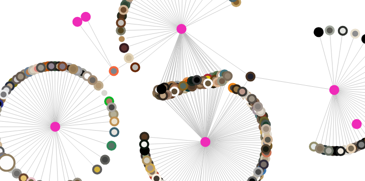

# Explore WCMA
[**Explore WCMA**](https://www.lester-lee.com/wcma-viz/) is a way to find pieces in the collection that you haven't seen before by following an artwork's connections through exhibits. You can also get a quick sense of the color scheme of each exhibit! 

I am [Lester Lee](https://www.lester-le.com), a Computer Science major at Williams College.

In Fall'18, I did an independent study on information visualization with [Professor Iris Howley](http://www.cs.williams.edu/~iris/). More information about my independent study can be found on [my blog](https://www.lester-lee.com/f2018-info-vis/). This blog also contains my process for working on this project!

Much thanks to the [Williams College Museum of Art (WCMA)](https://github.com/wcmaart/collection) for providing me with data and helping me out with this project!
